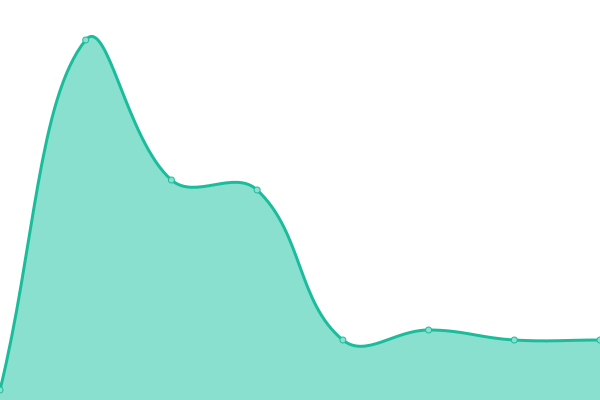
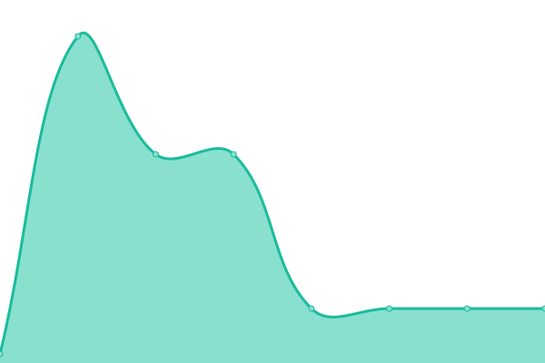

# [📈 Live Status](https://upptime.github.io/upptime): <!--live status--> **🟧 Partial outage**

This repository contains the open-source uptime monitor and status page for [RingCX](https://www.ringcentral.com/ca/en/ringcx.html), powered by [Upptime](https://github.com/upptime/upptime).

We use [Issues](https://github.com/MarkAlexRC/rcxuptime/issues) as incident reports, [Actions](https://github.com/MarkAlexRC/rcxuptime/actions) as uptime monitors, and [Pages](https://markalexrc.github.io/rcxuptime/) for the status page.

<!--start: status pages-->
<!-- This summary is generated by Upptime (https://github.com/upptime/upptime) -->
<!-- Do not edit this manually, your changes will be overwritten -->
<!-- prettier-ignore -->
| URL | Status | History | Response Time | Uptime |
| --- | ------ | ------- | ------------- | ------ |
|  [ringcx.ringcentral.com/443](ringcx.ringcentral.com) | 🟩 Up | [ringcx-ringcentral-com-443.yml](https://github.com/MarkAlexRC/rcxuptime/commits/HEAD/history/ringcx-ringcentral-com-443.yml) | 

 17ms
     
 | 

<a href="https://MarkAlexRC.github.io/rcxuptime/history/ringcx-ringcentral-com-443">100.00%</a>
    

|  [portal.vacd.biz/443](ringcx.ringcentral.com) | 🟩 Up | [portal-vacd-biz-443.yml](https://github.com/MarkAlexRC/rcxuptime/commits/HEAD/history/portal-vacd-biz-443.yml) | 

 17ms
     
 | 

<a href="https://MarkAlexRC.github.io/rcxuptime/history/portal-vacd-biz-443">100.00%</a>
    

|  [portal.vacd.biz/8081](ringcx.ringcentral.com) | 🟥 Down | [portal-vacd-biz-8081.yml](https://github.com/MarkAlexRC/rcxuptime/commits/HEAD/history/portal-vacd-biz-8081.yml) | 

 0ms
     
 | 

<a href="https://MarkAlexRC.github.io/rcxuptime/history/portal-vacd-biz-8081">0.00%</a>
    

|  [engage.ringcentral.com/443](ringcx.ringcentral.com) | 🟩 Up | [engage-ringcentral-com-443.yml](https://github.com/MarkAlexRC/rcxuptime/commits/HEAD/history/engage-ringcentral-com-443.yml) | 

 17ms
     
 | 

<a href="https://MarkAlexRC.github.io/rcxuptime/history/engage-ringcentral-com-443">100.00%</a>
    

|  [engage.ringcentral.com/8081](ringcx.ringcentral.com) | 🟥 Down | [engage-ringcentral-com-8081.yml](https://github.com/MarkAlexRC/rcxuptime/commits/HEAD/history/engage-ringcentral-com-8081.yml) | 

 0ms
     
 | 

<a href="https://MarkAlexRC.github.io/rcxuptime/history/engage-ringcentral-com-8081">0.00%</a>
    

<!--end: status pages-->

[**Visit our status website →**](https://markalexrc.github.io/rcxuptime/)

## 📄 License

- Powered by: [Upptime](https://github.com/upptime/upptime)
- Code: [MIT](./LICENSE) © [Anand Chowdhary](https://anandchowdhary.com)
